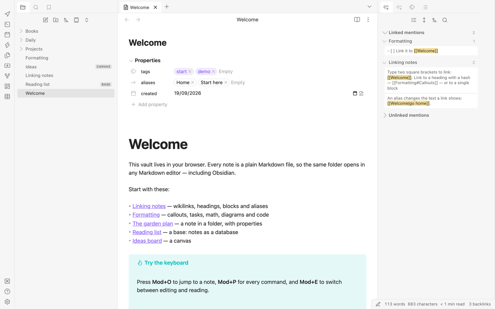

# OpenMarkdown

**Your Obsidian vault, in any browser: the same Markdown files and the same community plugins, with no install, no server and no account needed.**

OpenMarkdown opens the same folder of `.md` files Obsidian does, renders the same
syntax, and runs Obsidian community plugins and themes unmodified. It is an
independent, open-source implementation of the MIT-licensed
[Obsidian plugin API](https://github.com/obsidianmd/obsidian-api), and contains no
code from the Obsidian app.

- **Use it:** [openmarkdown.ai/app](https://openmarkdown.ai/app/), or
  download the web app from [Releases](../../releases) and serve it yourself.
- **Site:** [openmarkdown.ai](https://openmarkdown.ai)



More screenshots are in [docs/screenshots/](docs/screenshots/). They include the
graph, Canvas, Bases, search, Dataview, Tasks and Kanban running unmodified, and the
Minimal theme.

## What it does

| | |
|---|---|
| **Vaults** | A real folder on disk (Chrome, Edge, Brave, Arc, Opera — File System Access API), a vault stored in the browser (every modern browser, OPFS), or the demo vault. Edits land in the folder, so Obsidian and OpenMarkdown can open the same vault. |
| **Your notes are safe** | Saves while you type and when the tab closes; a failed save says so and retries; unsaved text is journalled and offered back after a crash; edits made outside the app, in another tab or another pane are merged (conflicts keep both sides, with a compare view); line endings, BOM and non-UTF-8 files are preserved; a vault folder that vanishes is never taken for mass deletion. |
| **Editor** | CodeMirror 6 with Live Preview, Source mode and Reading view; smart lists, tables, folding, vim, link/tag/heading/block autocomplete, paste HTML as Markdown, attachments. |
| **Writing** | Styled find & replace (case, whole word, regex, match count), Advanced Tables-style table keys plus a table toolbar (rows, columns, alignment, sort) and spreadsheet paste, focus mode with paragraph/sentence/line dimming, typewriter scrolling, full-screen writing, word/character counts with reading time and per-note or daily word goals, a desktop formatting toolbar, footnote hover previews, and — off by default — smart typography, vault word completion and on-device grammar checking (Harper). Each steps aside for the community plugin it replaces. |
| **Obsidian Flavored Markdown** | Wikilinks, heading/block links, embeds, callouts, tags, highlights, comments, math (MathJax), Mermaid, footnotes, tasks, properties. |
| **Core features** | File explorer, search with Obsidian's query language, quick switcher, command palette, backlinks and unlinked mentions, outgoing links, outline, tags, properties, bookmarks, page preview, graph view (global and local), Canvas (JSON Canvas), Bases (table, cards, list, map), daily notes, templates, unique notes, note composer, format converter, file recovery, workspaces, slides, audio recorder, web viewer, slash commands, export to HTML / PDF / static website. These are Obsidian's core plugins: Settings → Core plugins turns them on or off. |
| **Pre-installed plugins** | Everything OpenMarkdown adds beyond Obsidian — the rows below from Writing to Sync, plus the importer (Evernote, Notion, Roam, Keep, Bear, Logseq, HTML, CSV), quick capture and trash — is a pre-installed plugin: shipped with the app and installed in every vault, listed in Settings → Community plugins with a "Pre-installed" tag, and uninstallable (and reinstallable offline) per vault. Their state lives in `.obsidian/openmarkdown-plugins.json`, so `core-plugins.json` and `community-plugins.json` stay as Obsidian writes them. Editor switches (tables, smart typography, word completion, focus), data safety, the installed-app shell, mobile layout and Settings → AI are part of the app, not plugins. |
| **Community plugins** | The plugin store lists all ~7,600 plugins and ~750 themes. 24 of the top 25 plugins — every one that is not desktop-only — load and pass their core flows: Dataview, Tasks, Templater, Kanban, Excalidraw, Calendar, Outliner, Advanced Tables, Style Settings, QuickAdd, Linter, Iconize, … See [docs/plugin-compatibility.md](docs/plugin-compatibility.md). |
| **Paste & media** | YouTube, Vimeo and X/Twitter embeds from ``, and — off by default — link titles on paste (`[Title](url)`, Auto Link Title's format), link cards, a media player with Media Extended timestamp links, and downloading remote images into the vault. |
| **Knowledge** | Show notes by their `title` property or first heading (explorer, tabs, quick switcher, search, backlinks), replace across the vault with a checkbox preview and undo, rename tags across notes and frontmatter, rename/retype/delete properties vault-wide, nested properties, a custom drag-to-reorder file order, a trash view with restore, keyboard navigation of search results, open links in a new tab, and — off by default — weekly/monthly/quarterly/yearly notes, a calendar of daily notes and `@next monday` dates. Each steps aside for the community plugin it replaces. |
| **Export & write-ups** | Copy as rich text (pastes into Google Docs, Word, Gmail, Notion with images and math), Word (.docx) and EPUB export written in the browser, PDF with page size, margins, headers, footers, page numbers and a table of contents (one note, a folder or a selection), LaTeX / ODT / RTF / PowerPoint through pandoc downloaded only after you agree, Advanced Slides decks presented with reveal.js (speaker view, self-contained HTML export), and — off by default — citations from BibTeX, CSL-JSON or Zotero with `[@citekey]` autocomplete, APA/Chicago or any CSL style, literature notes and bibliographies. Each steps aside for the community plugin it replaces. |
| **Device & AI** | Off by default and feature-detected; the device features below run on this device: text recognition in images and scanned PDFs (Tesseract on this device; Text Extractor's API for Omnisearch), dictation with on-device speech recognition and read aloud, summarize / translate / rewrite / proofread / ask about a note with the browser's built-in AI, reminders in the Reminder plugin's `(@2026-09-15 09:00)` syntax with notifications and `.ics` export, scheduled zip backups with restore, web panes (Custom Frames presets), and "Try to load anyway" for desktop-only plugins. |
| **Sync** | End-to-end encrypted sync between devices, built on OpenSync: pair a device with a ten-character code, a printed recovery kit, live updates, conflict review, one syncing tab per vault, keys that never appear on screen. Your own relay or the hosted one. Interoperates with the OpenSync Obsidian plugin. |
| **Phone, tablet, installed app** | Obsidian mobile's layout (drawers, bottom navigation, a toolbar above the keyboard) on touch devices; works offline; open `.md` files from the OS, share to the app, quick capture (Mod+Alt+N or a capture URL), pop-out windows. |
| **Companion extension** | `apps/clipper`: a web clipper compatible with Obsidian Web Clipper templates, plus a network bridge so plugins' `requestUrl` and plugin installs from GitHub work despite CORS, and — only for sites you allow — lets web panes show sites that refuse framing. |
| **CLI** | `vault` (crates/vault-cli): search, backlinks, render, export, publish, run a base, clip, import — over a vault folder. |

## Install

Every [release](../../releases) has these files attached. Tags such as `v0.1.0-rc.1` are
release candidates for testing and are marked as pre-releases. Each release's notes
repeat these steps.

| File | What it is |
|---|---|
| `openmarkdown-web-<version>.zip` | The web app as a static site. Unzip it onto any static host (GitHub Pages, Netlify, nginx), or run `npx serve <folder>` locally. It works at the root of a site or under a sub-path such as `/app/`. It needs `http://localhost` or HTTPS, not `file://`. |
| `openmarkdown-clipper-chrome-<version>.zip` | The companion extension for Chrome, Edge, Brave and Arc. Unzip it, open `chrome://extensions`, turn on **Developer mode**, click **Load unpacked** and pick the folder. |
| `openmarkdown-clipper-firefox-<version>.zip` | The same extension for Firefox 128 or later. Unzip it, open `about:debugging#/runtime/this-firefox`, click **Load Temporary Add-on…** and pick its `manifest.json`. |
| `vault-<version>-<platform>.tar.gz` / `.zip` | The `vault` command-line tool and MCP server for macOS (arm64 and x86_64), Linux x86_64 and Windows x86_64. |

The extension is not in any browser store yet.

## The companion extension

`apps/clipper` is a web clipper that works with Obsidian Web Clipper templates. It also
provides a network bridge, so plugins' `requestUrl` calls and plugin installs from
GitHub work despite CORS. For sites you allow, it lets web panes show pages that refuse
to be framed. It talks only to the app origins listed in its settings. The defaults
are `http://localhost:5200`, `http://localhost` and `https://openmarkdown.ai`, and you
can add your own host.

## `vault`: the CLI and MCP server

`vault` (`crates/vault-cli`) works on a vault folder from the command line. It can
search with Obsidian's query language, list backlinks, render notes, export and publish
a static site, run a base, clip a page, import from other apps, and rename a note with
its links updated. `vault mcp <folder>` serves the vault to AI agents such as Claude
Code and Claude Desktop over the Model Context Protocol. It uses the same link
resolution and search as the app, and it has a `--read-only` mode. See
[docs/mcp.md](docs/mcp.md) for setup and the tool list.

```sh
vault --vault ~/Notes search 'tag:#project "launch"'
claude mcp add --transport stdio notes -- /absolute/path/to/vault mcp /absolute/path/to/Notes
```

## Pre-installed plugins

Obsidian's core features (file explorer, search, graph, Canvas, Bases, daily notes
and the rest) are core plugins here too. Everything OpenMarkdown adds beyond Obsidian
is a **pre-installed plugin**: it ships with the app, is installed in every vault,
appears in Settings → Community plugins with a "Pre-installed" tag, and can be
uninstalled or reinstalled (offline) per vault. When you install the community plugin
a feature replaces, that feature steps aside. Their state lives in
`.obsidian/openmarkdown-plugins.json`, so `core-plugins.json` and
`community-plugins.json` stay exactly as Obsidian writes them.

## AI

AI is **off by default**. Settings → AI turns it on, and each feature then has its own
switch. Nothing runs, downloads or sends until you turn it on. The app uses on-device
engines first: the browser's built-in models, and transformers.js on WebGPU or WASM.
Local servers (Ollama, LM Studio) and cloud providers (Anthropic, OpenAI, Google) work
only with your own key and only when you choose them. The first request that would send
text off the device asks first, and every result says where it ran. Keys are stored
encrypted in this browser and never written to the vault.

## Sync

End-to-end encrypted sync between devices, built on OpenSync. Sync is compiled in only when an `opensync`
checkout sits beside this repository (`../opensync`). Without it, as in the release
builds and CI, the app builds and runs without sync and the Sync UI stays hidden. See
Limits below for the relay.

## How it is built

```
crates/        Rust, no I/O, compiled natively and to WebAssembly
  vault-ofm      Obsidian Flavored Markdown → metadata (UTF-16 positions) + HTML sections
  vault-index    link resolution, backlinks, tags, search language, fuzzy match, graph + force layout, rename rewrites
  vault-bases    .base files and their expression language
  vault-clip     readable extraction, HTML → Markdown, clipper templates, importers
  vault-publish  note → HTML, vault → static site
  vault-wasm     the browser bindings;  vault-cli  the native binary
packages/
  engine       typed TypeScript wrapper over the wasm module
  app          the `obsidian` API implemented as the application, the editor, core plugins, settings, store, default theme
apps/
  web          the static PWA        clipper   the companion browser extension
```

The `obsidian` module *is* the application: every core feature is a plugin
written against the same `App`/`Vault`/`Workspace` objects a community plugin
receives. See [docs/ARCHITECTURE.md](docs/ARCHITECTURE.md) and the research
behind the design in [docs/research/](docs/research/).

## Build from source

You need Node 22 or later, Rust stable with the `wasm32-unknown-unknown` target, and
`wasm-bindgen-cli` **0.2.126**. It must match the `wasm-bindgen` pin in
`Cargo.toml`. `wasm-opt` (binaryen) is optional.

```sh
rustup target add wasm32-unknown-unknown
cargo install wasm-bindgen-cli --version 0.2.126 --locked

npm ci
npm run build:wasm            # Rust engine → packages/engine/src/wasm-gen (generated, not committed)
npm run dev                   # http://localhost:5200
npm run build:web             # static site → apps/web/dist
npm run build -w @vault/clipper   # extension → apps/clipper/dist and dist-firefox
cargo build --release -p vault-cli   # CLI → target/release/vault
```

## Test

```sh
cargo test --workspace                      # Rust
npm run typecheck                           # TypeScript (after build:wasm)
npm run build:web
npx playwright test e2e/app.spec.ts e2e/clipper.spec.ts e2e/daily/subpath.spec.ts   # what CI runs
npx playwright test e2e/daily               # data safety, editor, mobile, knowledge, media, export, device, PWA, sync
node scripts/fetch-plugin-bundles.mjs <plugin-bundles>   # the pinned plugin releases + Minimal theme
node e2e/compat/run.mjs <plugin-bundles> <out>   # community plugin scenarios
```

CI (`.github/workflows/ci.yml`) runs the Rust tests, the typecheck, both builds and the
three Playwright suites named above on every push and pull request.
`.github/workflows/release.yml` builds and attaches every release file when a `v*` tag
is pushed. It can also be started from Actions → Release → Run workflow with a version.

## Limits

- Real folders need a Chromium browser. Firefox and Safari use browser storage with import/export.
- Desktop-only plugins (those that need Node or Electron) are refused, as on Obsidian mobile.
- Plugins that call arbitrary web APIs (Git remotes, sync services, AI providers) need the companion extension's network bridge or a proxy.
- Pop-out windows are same-origin browser windows driven by the main tab (they close with it and are not restored after a reload); if the browser blocks them they open as a split.
- File handling (double-click a `.md`), the share sheet and `web+obsidian://` links need an installed app in a Chromium browser; iOS capture goes through a Shortcuts recipe ([docs/quick-capture.md](docs/quick-capture.md)).
- Sync needs `../opensync` next to this repo at build time; without it the app builds without sync. The hosted relay admits accounts individually, so a self-hosted relay is the way to sync today. One vault per account.
- Built-in AI, dictation and text detection use browser APIs that only some browsers have (Chrome's on-device models); the features hide themselves elsewhere.

## Contributing

Issues and pull requests are welcome.

- Read [docs/ARCHITECTURE.md](docs/ARCHITECTURE.md) first. The `obsidian` module *is*
  the application: a feature is a plugin written against the same
  `App`/`Vault`/`Workspace` objects a community plugin receives. Parsing, indexing and
  search live in the Rust crates, which do no I/O.
- Community plugin compatibility comes first. Behaviour should match Obsidian's public
  API and documentation. A change that breaks a plugin in
  [docs/plugin-compatibility.md](docs/plugin-compatibility.md) needs a very good reason.
- **No material from the Obsidian app.** Do not copy, decompile or reverse-engineer
  Obsidian's application code or styles. Work only from its public API, documentation
  and observable behaviour. The provenance rules are in
  [docs/research/dom-and-css.md](docs/research/dom-and-css.md).
- Add a test with the change. Rust tests go next to the crate. App behaviour goes in a
  Playwright spec under `e2e/`. Run `cargo test --workspace`, `npm run typecheck` and
  the relevant e2e suite before opening a pull request.
- New npm dependencies should be small, permissively licensed (MIT, Apache or BSD) and
  imported lazily where possible.

By contributing, you agree that your contribution is licensed under the same terms as
the project (MIT OR Apache-2.0), without any additional terms or conditions.

## Trademark

"Obsidian" is a trademark of Dynalist Inc. OpenMarkdown is an independent project. It
is not affiliated with, endorsed by or sponsored by Obsidian or Dynalist Inc. The name
appears here only to describe compatibility ("opens Obsidian vaults"). The product
name is held in one place, `packages/app/src/product.ts`.

## Licence

Licensed under either of

- Apache License, Version 2.0 ([LICENSE-APACHE](LICENSE-APACHE))
- MIT license ([LICENSE-MIT](LICENSE-MIT))

at your option.

Bundled third-party files keep their own licences. For example, the CSL citation
styles in `packages/app/src/core-plugins/citations/csl/` are CC BY-SA 3.0, and
`docs/research/obsidian.d.ts` is from the MIT-licensed `obsidianmd/obsidian-api`.
